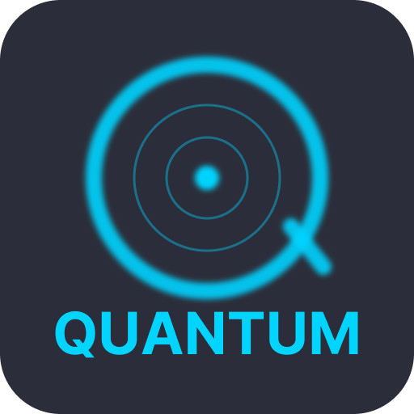

# Quantum

Nintendo Switch download manager with multi-provider support, automatic 7-Zip extraction, and real-time progress tracking — built with Electron + Vite + React.



---

  

## Overview

Quantum is a desktop application that organizes and manages downloads for Nintendo Switch compatible content. It integrates multiple providers, handles parallel queues, performs automatic file verification and extraction with 7-Zip, and offers real-time progress and status feedback.

- Modern React interface (Electron Renderer)
- TypeScript main process (Electron Main)
- Built-in auto-update (electron-updater)
- Structured logging (electron-log)
- Cross-platform packaging (electron-builder)

## Features

- Multi-provider content support
  - Configurable catalogs and parsers in [src/main/providers](src/main/providers/index.ts)
- Download queue manager
  - Priority, pause/resume, cancellation, and retries: [src/main/services/download-queue.ts](src/main/services/download-queue.ts)
- Automatic 7-Zip extraction
  - Platform-specific binary integration: [src/main/services/7zip.ts](src/main/services/7zip.ts)
- Automatic updates
  - GitHub Releases publishing configuration: [electron-builder.yml](electron-builder.yml)
- Notifications and status feedback
  - UI with reusable components in [src/renderer/components](src/renderer/components)

## Installation (End Users)

Distribution builds can be generated for Windows, macOS, and Linux. If you're installing for use, prefer the published installers (when available) in GitHub Releases.

## Development

### Prerequisites

- Node.js 18+ (recommended)
- Yarn (or npm/pnpm)
- Windows, macOS, or Linux

### Install dependencies

```bash
yarn install
```

### Development environment

- Dev (Electron + Vite with hot reload):

```bash
yarn dev
```

- Preview packaged app in development mode:

```bash
yarn start
```

### Code quality

```bash
yarn lint         # ESLint with cache
yarn format       # Prettier
yarn typecheck    # TypeScript (node + web)
```

## Build & Distribution

Before packaging, ensure typecheck passes:

```bash
yarn build
```

Platform-specific artifact generation:

```bash
yarn build:win    # Windows (NSIS, Portable)
yarn build:mac    # macOS (dmg)
yarn build:linux  # Linux (AppImage, snap, deb)
```

Packaging and publishing configuration is in [electron-builder.yml](electron-builder.yml). The `productName` is "Quantum" and the `appId` is `com.lwproducoes.quantum`.

## Architecture

- Main process (Electron Main): [src/main/index.ts](src/main/index.ts)
- Preload (secure sandbox): [src/preload/index.ts](src/preload/index.ts)
- Renderer (UI + React): [src/renderer/src/main.tsx](src/renderer/src/main.tsx)
- Providers: [src/main/providers](src/main/providers/index.ts)
- Hoster integrations: [src/main/services/hosters](src/main/services/hosters)
- Download queue: [src/main/services/download-queue.ts](src/main/services/download-queue.ts)
- 7-Zip extraction: [src/main/services/7zip.ts](src/main/services/7zip.ts)
- Auto-updater: [src/main/services/updater.ts](src/main/services/updater.ts)
- Logs: [src/main/services/logger.ts](src/main/services/logger.ts)

## How to Use (Summary)

1. Add or select a supported source/provider.
2. Search for content and add it to the download queue.
3. Monitor real-time progress on the Downloads screen.
4. Upon completion, Quantum automatically validates and extracts files when applicable.

Note: Experience may vary depending on the provider and file hoster. On Windows, 7-Zip binaries are bundled (see `binaries/` folder).

## Updates

The app supports automatic updates via `electron-updater`. Releases are published on GitHub as defined in [electron-builder.yml](electron-builder.yml) (`publish.provider: github`).

## Logs & Diagnostics

Logs are managed with `electron-log`. If you encounter issues, check log files and share relevant excerpts when opening issues.

## Contributing

Contributions are welcome! Before opening a PR:

- Run `yarn lint`, `yarn format`, and `yarn typecheck`.
- Maintain code style and add tests when applicable.
- Avoid changes unrelated to the PR scope.

## License

This project is licensed under MIT. See [LICENSE](LICENSE).

## Legal Disclaimer

This software is intended exclusively for legal purposes, such as managing content you own and have the right to use. It does not provide, host, or promote links to copyrighted materials. You are solely responsible for complying with local laws and the terms of service of each platform. Do not use Quantum to infringe copyrights or other applicable legislation.

---

### Credits

- [Hydra Launcher](https://github.com/hydralauncher/hydra) - Inspiration and code references for download management and file extraction services
- Electron, Vite, React, and the OSS community
- 7-Zip (integration via `node-7z`)

If anything is missing or you'd like to include screenshots, open an issue or contribute directly.
